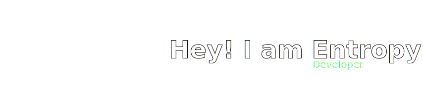
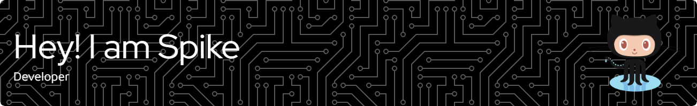

<!--  -->

### Hello World 👋

- ⚡ Focusing on Java and ...
- 🔭 I’m currently working IoT
- 🌱 I’m be interested in 42
- 📫 How to reach me: https://chaosbynn.github.io 

 

<!--
**ChaoSBYNN/ChaoSBYNN** is a ✨ _special_ ✨ repository because its `README.md` (this file) appears on your GitHub profile.

Here are some ideas to get you started:

- 🔭 I’m currently working on ...
- 🌱 I’m currently learning ...
- 👯 I’m looking to collaborate on ...
- 🤔 I’m looking for help with ...
- 💬 Ask me about ...
- 📫 How to reach me: ...
- 😄 Pronouns: ...
- ⚡ Fun fact: ...
-->

